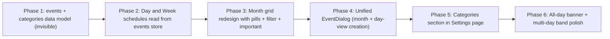

# Month View Redesign — Implementation Guide

This document is the canonical, self-contained instruction set for redesigning the month view from a task-list grid into an events-first calendar with categories and an "important" flag. It is structured so another agent or developer can apply these changes to a fresh copy of the codebase without additional context.

## Table of contents

- [Goal](#goal)
- [Architectural decisions](#architectural-decisions)
- [Phased rollout](#phased-rollout)
- [Phase 1: data model and migration (invisible)](#phase-1-data-model-and-migration-invisible) — **shipped**
- [Phase 2: day and week schedules read from the events store](#phase-2-day-and-week-schedules-read-from-the-events-store) — **shipped**
- [Phase 3: month grid redesign](#phase-3-month-grid-redesign) — **shipped**
- [Phase 4: unified EventDialog](#phase-4-unified-eventdialog) — **shipped**
- [Phase 5: CategoriesSettings section](#phase-5-categoriessettings-section) — **shipped**
- [Phase 6: all-day and multi-day polish](#phase-6-all-day-and-multi-day-polish) — in progress (split into 6a–6e)
  - Phase 6a: all-day banner in Day view — **shipped**
  - Phase 6b: all-day band in Week view — pending
  - Phase 6c: multi-day continuous bands in Month view — pending
  - Phase 6d: `EventPill` hover tooltip — pending
  - Phase 6e: dark-mode palette tuning per `ColorKey` — pending

---

## Goal

Replace the cluttered task-list month view with a forward-looking events view. The month answers one question: **"What's happening this month?"** Tasks remain in day and week views; in the month they only appear as a small per-day count badge.

Three pillars:

1. **Events only** — tasks are not rendered as rows in the month view.
2. **Categories with color coding** — every event has a category. Categories are color-coded so the user can scan the month and instantly recognize types of commitments.
3. **Importance flag** — events can be flagged as important. Flagged events render bolder, sort to the top of the day, and can be filtered to show alone.

## Architectural decisions

- **Unified events model.** Per-day, minute-offset `TimeBlock`s are replaced by a single global `CalendarEvent[]` store with ISO-like floating-local-time datetimes, an `allDay` flag, and multi-day support. Day and week schedule UIs project events back into the existing minute-offset shape on read.
- **Day-cell click in month view always opens EventDialog in create mode.** No navigation from month to day.
- **State = React context + localStorage** (no zustand — matches the existing `PomodoroProvider` pattern). Storage keys keep the existing `weeklyPlanner_*` prefix.
- **Existing `PlannerHeader` already renders the month title.** The new month toolbar (filter, Important toggle) extends `MonthNavBar`. **No legend strip** — categories are recognized from pill colors and the filter dropdown; CRUD lives in Settings.
- **Simplified visual language.** Pills are flat, full-width colored rectangles with text only — no flag icon, no leading dot. Day cell shows only date number + tiny `• N` task count badge + stacked pills. No "Today" text badge — today is conveyed by a soft theme-tinted wash (`bg-surface-accent`) and the date number in the theme's primary color (`text-primary`).
- **Theme consistency.** All chrome uses existing semantic tokens (`bg-card`, `border-border`, `planner-card-surface`, `text-foreground-subtle`, `text-muted-foreground`, `type-caption`, `type-meta`, `type-ui`). Only the category palette is hard-coded (categories are identity colors, not theme tokens). `bg-surface-accent` and `text-primary` are defined per-theme in light and dark, so the today indicator automatically morphs (pink in Blush, mint in Matcha, lavender in Lavender, warm tan in Boho, neutral in Minimal).
- **Important rendering.** Pill text becomes `font-semibold` and important events sort to the top of the cell. No icon, no border accent (can upgrade later if too quiet).
- **Floating local time** for `startsAt` / `endsAt` (no `Z`, no offset). This avoids DST drift: an event at 10am stays at 10am after a DST transition.

## Phased rollout

Each phase is independently testable. Pause after each for verification.



---

## Phase 1: data model and migration (invisible)

**Goal:** introduce the global `CalendarEvent` store and `CategoryDefinition` store. Seed the five default categories. One-time migrate existing `DayData.timeBlocks` into the new events store. No UI changes — day/week views still read `timeBlocks` directly until Phase 2.

### Storage layout

| Key | Type | Purpose |
|---|---|---|
| `weeklyPlanner_events` | `CalendarEvent[]` | Global event store |
| `weeklyPlanner_categories` | `CategoryDefinition[]` | User categories (defaults auto-seeded) |
| `weeklyPlanner_eventsMigrated` | `"true"` | Idempotency flag for the one-time TimeBlock → Event migration |

Existing `weeklyPlanner_data.days[*].timeBlocks` is left on disk for one release (read-only fallback for safe rollback).

### Backup format

`PlannerBackupV1` is extended additively with optional `events` and `categories` fields. Legacy v1 backups (without these fields) still import; on import, missing events/categories simply aren't restored. New exports include both.

### File 1.1: extend `src/lib/types.ts`

Append to the bottom of `src/lib/types.ts`:

```ts
export type ColorKey =
  | 'pink'
  | 'green'
  | 'blue'
  | 'amber'
  | 'purple'
  | 'teal'
  | 'coral'
  | 'gray'
  | 'red';

/** Stable id for the seeded fallback category; never deleted. */
export const FALLBACK_CATEGORY_ID = 'personal';

export interface CategoryDefinition {
  id: string;
  label: string;
  colorKey: ColorKey;
  isDefault: boolean;
  order: number;
}

/**
 * Calendar event stored in floating local time (no timezone suffix).
 * Format: "YYYY-MM-DDTHH:mm:ss" for timed events.
 * All-day events use "${date}T00:00:00" → next-day "${date+1}T00:00:00" (exclusive).
 * Floating time avoids DST drift: an event at 10am stays at 10am after DST transitions.
 */
export interface CalendarEvent {
  id: string;
  title: string;
  startsAt: string;
  endsAt: string;
  allDay: boolean;
  categoryId: string;
  important: boolean;
}

export const MAX_CATEGORY_LABEL_LENGTH = 40;
export const MAX_EVENT_TITLE_LENGTH = 200;
```

### File 1.2: create `src/lib/palette.ts` (new file)

Full source:

```ts
import type { ColorKey } from "./types";

export interface PaletteEntry {
  /** Saturated swatch color for legend dots, color pickers, focus rings. */
  dot: string;
  /** Soft tinted surface used as event-pill background. */
  bg: string;
  /** Readable foreground tuned for AA contrast on `bg`. */
  text: string;
}

/**
 * Category identity colors.
 *
 * Hard-coded by design — these are recognizable user identifiers, not theme tokens.
 * Defaults (pink/green/blue/amber/purple) ship with the five seeded categories.
 * The remaining four (teal/coral/gray/red) are reserved for user-created categories.
 */
export const PALETTE: Record<ColorKey, PaletteEntry> = {
  pink: { dot: "#D4537E", bg: "#FBEAF0", text: "#72243E" },
  green: { dot: "#1D9E75", bg: "#E1F5EE", text: "#085041" },
  blue: { dot: "#378ADD", bg: "#E6F1FB", text: "#0C447C" },
  amber: { dot: "#EF9F27", bg: "#FAEEDA", text: "#633806" },
  purple: { dot: "#7F77DD", bg: "#EEEDFE", text: "#3C3489" },
  teal: { dot: "#1D9E75", bg: "#E1F5EE", text: "#085041" },
  coral: { dot: "#D85A30", bg: "#FAECE7", text: "#712B13" },
  gray: { dot: "#888780", bg: "#F1EFE8", text: "#444441" },
  red: { dot: "#E24B4A", bg: "#FCEBEB", text: "#791F1F" },
};

export const ALL_COLOR_KEYS: ColorKey[] = [
  "pink",
  "green",
  "blue",
  "amber",
  "purple",
  "teal",
  "coral",
  "gray",
  "red",
];

/** Colors not used by seed categories — surfaced first in the custom-category color picker. */
export const CUSTOM_COLOR_KEYS: ColorKey[] = ["teal", "coral", "gray", "red"];

export function paletteFor(colorKey: ColorKey): PaletteEntry {
  return PALETTE[colorKey] ?? PALETTE.gray;
}

export function isColorKey(value: unknown): value is ColorKey {
  return typeof value === "string" && value in PALETTE;
}
```

### File 1.3: create `src/lib/categories.ts` (new file)

Full source:

```ts
import {
  CategoryDefinition,
  ColorKey,
  FALLBACK_CATEGORY_ID,
  MAX_CATEGORY_LABEL_LENGTH,
} from "./types";
import { isColorKey } from "./palette";

const STORAGE_KEY = "weeklyPlanner_categories";

export const DEFAULT_CATEGORIES: readonly CategoryDefinition[] = [
  { id: "family", label: "Family", colorKey: "pink", isDefault: true, order: 0 },
  { id: "health", label: "Health", colorKey: "green", isDefault: true, order: 1 },
  { id: "work", label: "Work", colorKey: "blue", isDefault: true, order: 2 },
  { id: "social", label: "Social", colorKey: "amber", isDefault: true, order: 3 },
  { id: "personal", label: "Personal", colorKey: "purple", isDefault: true, order: 4 },
] as const;

function cloneDefaults(): CategoryDefinition[] {
  return DEFAULT_CATEGORIES.map((c) => ({ ...c }));
}

function normalizeCategory(raw: unknown): CategoryDefinition | null {
  if (typeof raw !== "object" || raw === null) return null;
  const c = raw as Partial<CategoryDefinition>;
  if (typeof c.id !== "string" || !c.id.trim()) return null;
  if (typeof c.label !== "string") return null;
  if (!isColorKey(c.colorKey)) return null;
  return {
    id: c.id,
    label: c.label.slice(0, MAX_CATEGORY_LABEL_LENGTH),
    colorKey: c.colorKey,
    isDefault: Boolean(c.isDefault),
    order: typeof c.order === "number" && Number.isFinite(c.order) ? c.order : 0,
  };
}

function normalizeCategoryList(raw: unknown): CategoryDefinition[] | null {
  if (!Array.isArray(raw)) return null;
  const list = raw
    .map(normalizeCategory)
    .filter((c): c is CategoryDefinition => c !== null);
  return list.length > 0 ? list : null;
}

/** Persist categories list. Returns true on success. */
export function saveCategories(categories: CategoryDefinition[]): boolean {
  try {
    localStorage.setItem(STORAGE_KEY, JSON.stringify(categories));
    return true;
  } catch (e) {
    console.error("Failed to save categories", e);
    return false;
  }
}

/**
 * Read categories from storage. Seeds defaults on first read.
 * Defaults are always merged so the five seeded ids stay available even if the
 * stored list got truncated.
 */
export function getCategories(): CategoryDefinition[] {
  let stored: CategoryDefinition[] | null = null;
  try {
    const raw = localStorage.getItem(STORAGE_KEY);
    if (raw) {
      stored = normalizeCategoryList(JSON.parse(raw));
    }
  } catch (e) {
    console.error("Failed to parse categories", e);
  }

  if (!stored) {
    const defaults = cloneDefaults();
    saveCategories(defaults);
    return defaults;
  }

  const byId = new Map<string, CategoryDefinition>();
  for (const c of stored) byId.set(c.id, c);
  for (const d of DEFAULT_CATEGORIES) {
    if (!byId.has(d.id)) byId.set(d.id, { ...d });
  }

  const merged = Array.from(byId.values()).sort((a, b) => a.order - b.order);
  return merged;
}

export function getCategoryById(id: string): CategoryDefinition | undefined {
  return getCategories().find((c) => c.id === id);
}

export function getCategoryOrFallback(id: string): CategoryDefinition {
  const list = getCategories();
  const found = list.find((c) => c.id === id);
  if (found) return found;
  const fallback = list.find((c) => c.id === FALLBACK_CATEGORY_ID);
  return fallback ?? list[0];
}

function generateCategoryId(): string {
  return typeof crypto !== "undefined" && crypto.randomUUID
    ? `cat-${crypto.randomUUID()}`
    : `cat-${Date.now()}-${Math.random().toString(36).slice(2, 9)}`;
}

export function addCategory(input: {
  label: string;
  colorKey: ColorKey;
}): CategoryDefinition {
  const list = getCategories();
  const nextOrder = list.length === 0 ? 0 : Math.max(...list.map((c) => c.order)) + 1;
  const next: CategoryDefinition = {
    id: generateCategoryId(),
    label: input.label.slice(0, MAX_CATEGORY_LABEL_LENGTH),
    colorKey: input.colorKey,
    isDefault: false,
    order: nextOrder,
  };
  saveCategories([...list, next]);
  return next;
}

export function updateCategory(
  id: string,
  patch: Partial<Pick<CategoryDefinition, "label" | "colorKey">>,
): CategoryDefinition | null {
  const list = getCategories();
  const idx = list.findIndex((c) => c.id === id);
  if (idx === -1) return null;
  const current = list[idx];
  const next: CategoryDefinition = {
    ...current,
    label:
      typeof patch.label === "string"
        ? patch.label.slice(0, MAX_CATEGORY_LABEL_LENGTH)
        : current.label,
    colorKey: patch.colorKey ?? current.colorKey,
  };
  const updated = [...list];
  updated[idx] = next;
  saveCategories(updated);
  return next;
}

/**
 * Remove a category (defaults are never removed).
 * Caller is responsible for reassigning events that referenced this category.
 */
export function deleteCategory(id: string): boolean {
  const list = getCategories();
  const target = list.find((c) => c.id === id);
  if (!target || target.isDefault) return false;
  const next = list.filter((c) => c.id !== id);
  saveCategories(next);
  return true;
}
```

### File 1.4: create `src/lib/events.ts` (new file)

Full source:

```ts
import { addDays, format } from "date-fns";
import {
  CalendarEvent,
  FALLBACK_CATEGORY_ID,
  MAX_EVENT_TITLE_LENGTH,
  PlannerData,
} from "./types";
import { parseLocalDateStr } from "./dates";

const STORAGE_KEY = "weeklyPlanner_events";
const MIGRATION_FLAG_KEY = "weeklyPlanner_eventsMigrated";

const DATE_KEY_RE = /^\d{4}-\d{2}-\d{2}$/;
const FLOATING_DT_RE = /^\d{4}-\d{2}-\d{2}T\d{2}:\d{2}:\d{2}(?:\.\d+)?$/;

function pad2(n: number): string {
  return n.toString().padStart(2, "0");
}

/** Build a floating local-time ISO-like string from a date string + minute offset. */
export function buildFloatingDateTime(
  dateStr: string,
  minutesFromMidnight: number,
): string {
  const h = Math.floor(minutesFromMidnight / 60);
  const m = minutesFromMidnight % 60;
  return `${dateStr}T${pad2(h)}:${pad2(m)}:00`;
}

/** Start-of-day boundary for an all-day event. */
function dayStart(dateStr: string): string {
  return `${dateStr}T00:00:00`;
}

/** Exclusive end-of-day boundary (= next day at 00:00). */
function dayEndExclusive(dateStr: string): string {
  const next = addDays(parseLocalDateStr(dateStr), 1);
  return `${format(next, "yyyy-MM-dd")}T00:00:00`;
}

function isValidFloatingDateTime(value: unknown): value is string {
  return typeof value === "string" && FLOATING_DT_RE.test(value);
}

function normalizeEvent(raw: unknown): CalendarEvent | null {
  if (typeof raw !== "object" || raw === null) return null;
  const e = raw as Partial<CalendarEvent>;
  if (typeof e.id !== "string" || !e.id.trim()) return null;
  if (!isValidFloatingDateTime(e.startsAt)) return null;
  if (!isValidFloatingDateTime(e.endsAt)) return null;
  if (e.endsAt <= e.startsAt) return null;
  return {
    id: e.id,
    title:
      typeof e.title === "string"
        ? e.title.slice(0, MAX_EVENT_TITLE_LENGTH)
        : "",
    startsAt: e.startsAt,
    endsAt: e.endsAt,
    allDay: Boolean(e.allDay),
    categoryId:
      typeof e.categoryId === "string" && e.categoryId.trim()
        ? e.categoryId
        : FALLBACK_CATEGORY_ID,
    important: Boolean(e.important),
  };
}

export function normalizeEventList(raw: unknown): CalendarEvent[] {
  if (!Array.isArray(raw)) return [];
  return raw
    .map(normalizeEvent)
    .filter((e): e is CalendarEvent => e !== null);
}

export function saveEvents(events: CalendarEvent[]): boolean {
  try {
    localStorage.setItem(STORAGE_KEY, JSON.stringify(events));
    return true;
  } catch (e) {
    console.error("Failed to save events", e);
    return false;
  }
}

export function getEvents(): CalendarEvent[] {
  try {
    const raw = localStorage.getItem(STORAGE_KEY);
    if (!raw) return [];
    return normalizeEventList(JSON.parse(raw));
  } catch (e) {
    console.error("Failed to parse events", e);
    return [];
  }
}

function generateEventId(): string {
  return typeof crypto !== "undefined" && crypto.randomUUID
    ? `evt-${crypto.randomUUID()}`
    : `evt-${Date.now()}-${Math.random().toString(36).slice(2, 9)}`;
}

export function addEvent(input: Omit<CalendarEvent, "id"> & { id?: string }): CalendarEvent {
  const list = getEvents();
  const next: CalendarEvent = {
    id: input.id ?? generateEventId(),
    title: input.title.slice(0, MAX_EVENT_TITLE_LENGTH),
    startsAt: input.startsAt,
    endsAt: input.endsAt,
    allDay: input.allDay,
    categoryId: input.categoryId || FALLBACK_CATEGORY_ID,
    important: input.important,
  };
  saveEvents([...list, next]);
  return next;
}

export function updateEvent(
  id: string,
  patch: Partial<Omit<CalendarEvent, "id">>,
): CalendarEvent | null {
  const list = getEvents();
  const idx = list.findIndex((e) => e.id === id);
  if (idx === -1) return null;
  const current = list[idx];
  const next: CalendarEvent = {
    ...current,
    ...patch,
    id: current.id,
    title:
      typeof patch.title === "string"
        ? patch.title.slice(0, MAX_EVENT_TITLE_LENGTH)
        : current.title,
    categoryId: patch.categoryId || current.categoryId,
  };
  if (next.endsAt <= next.startsAt) return null;
  const updated = [...list];
  updated[idx] = next;
  saveEvents(updated);
  return next;
}

export function deleteEvent(id: string): boolean {
  const list = getEvents();
  const next = list.filter((e) => e.id !== id);
  if (next.length === list.length) return false;
  saveEvents(next);
  return true;
}

/** Reassign all events from `fromCategoryId` to `toCategoryId`. */
export function reassignEventsCategory(
  fromCategoryId: string,
  toCategoryId: string,
): number {
  const list = getEvents();
  let count = 0;
  const next = list.map((e) => {
    if (e.categoryId !== fromCategoryId) return e;
    count += 1;
    return { ...e, categoryId: toCategoryId };
  });
  if (count > 0) saveEvents(next);
  return count;
}

/**
 * Return events that touch the given day (inclusive overlap with [00:00, 24:00)).
 * String-comparison works because all floating local-time strings have the same
 * fixed format and precision.
 */
export function getEventsForDay(dateStr: string): CalendarEvent[] {
  if (!DATE_KEY_RE.test(dateStr)) return [];
  const start = dayStart(dateStr);
  const end = dayEndExclusive(dateStr);
  return getEvents().filter((e) => e.startsAt < end && e.endsAt > start);
}

/** True if an event spans more than the calendar day it starts on. */
export function isMultiDayEvent(event: CalendarEvent): boolean {
  const startDate = event.startsAt.slice(0, 10);
  const endDate = event.endsAt.slice(0, 10);
  if (startDate === endDate) return false;
  if (event.allDay) {
    const next = addDays(parseLocalDateStr(startDate), 1);
    return endDate !== format(next, "yyyy-MM-dd");
  }
  return true;
}

/**
 * One-time migration from per-day `DayData.timeBlocks` to the global Events store.
 * Idempotent: guarded by `weeklyPlanner_eventsMigrated` flag in localStorage.
 *
 * Each TimeBlock becomes a CalendarEvent in the FALLBACK category, not important.
 * Original timeBlocks are left in place on disk for safe rollback (Phase 2 will
 * stop reading them).
 */
export function migrateTimeBlocksToEventsIfNeeded(planner: PlannerData): void {
  try {
    if (localStorage.getItem(MIGRATION_FLAG_KEY) === "true") return;
  } catch {
    return;
  }

  const existing = getEvents();
  const existingIds = new Set(existing.map((e) => e.id));
  const migrated: CalendarEvent[] = [];

  for (const [dateStr, day] of Object.entries(planner.days)) {
    if (!DATE_KEY_RE.test(dateStr)) continue;
    const blocks = day?.timeBlocks;
    if (!Array.isArray(blocks)) continue;
    for (const block of blocks) {
      if (!block || typeof block.id !== "string") continue;
      if (existingIds.has(block.id)) continue;
      const startMinute = Math.max(0, Math.floor(Number(block.startMinute)));
      const durationMinutes = Math.max(0, Math.floor(Number(block.durationMinutes)));
      if (!Number.isFinite(startMinute) || !Number.isFinite(durationMinutes)) continue;
      if (durationMinutes <= 0) continue;
      const startsAt = buildFloatingDateTime(dateStr, startMinute);
      const endMinute = Math.min(24 * 60, startMinute + durationMinutes);
      const endsAt =
        endMinute >= 24 * 60
          ? dayEndExclusive(dateStr)
          : buildFloatingDateTime(dateStr, endMinute);
      migrated.push({
        id: block.id,
        title: typeof block.label === "string" ? block.label : "",
        startsAt,
        endsAt,
        allDay: false,
        categoryId: FALLBACK_CATEGORY_ID,
        important: false,
      });
    }
  }

  if (migrated.length > 0) {
    saveEvents([...existing, ...migrated]);
  }

  try {
    localStorage.setItem(MIGRATION_FLAG_KEY, "true");
  } catch (e) {
    console.error("Failed to set events migration flag", e);
  }
}
```

### File 1.5: modify `src/lib/storage.ts`

Five edits.

**Edit 1.5.a — imports.** At the top, after the existing `./types` import, add:

```ts
import {
  CalendarEvent,
  CategoryDefinition,
} from './types';
import {
  getEvents,
  saveEvents,
  normalizeEventList,
  migrateTimeBlocksToEventsIfNeeded,
} from './events';
import { getCategories, saveCategories } from './categories';
```

(Add `CalendarEvent` and `CategoryDefinition` to the existing `./types` import line rather than duplicating it.)

**Edit 1.5.b — extend `PlannerBackupV1`.** In the existing interface declaration, add two optional fields:

```ts
export interface PlannerBackupV1 {
  version: typeof PLANNER_BACKUP_VERSION;
  exportedAt: string;
  planner: PlannerData;
  preferences: PlannerBackupPreferences;
  /** Additive in this release; absent in legacy v1 exports. */
  events?: CalendarEvent[];
  /** Additive in this release; absent in legacy v1 exports. */
  categories?: CategoryDefinition[];
}
```

**Edit 1.5.c — include events/categories in `buildPlannerBackup()`.** Add the two fields to the returned object:

```ts
return {
  // ...existing fields...
  events: getEvents(),
  categories: getCategories(),
};
```

**Edit 1.5.d — restore events/categories in `importPlannerBackup()`.** In the v1 import branch, after `savePlannerData` succeeds and before `applyBackupPreferences`, insert:

```ts
if (Array.isArray(raw.events)) {
  saveEvents(normalizeEventList(raw.events));
}
if (Array.isArray(raw.categories)) {
  saveCategories(raw.categories);
}
```

**Edit 1.5.e — boot init, and keep events consistent with reset/demo paths.**

Add a new exported function near `initAppearance()`:

```ts
/**
 * Seed default categories (if none yet) and run the one-time TimeBlock → Event
 * migration. Safe to call on every boot — both steps are idempotent.
 */
export function initEventsAndCategories(): void {
  try {
    getCategories();
    migrateTimeBlocksToEventsIfNeeded(getPlannerData());
  } catch (e) {
    console.error("Failed to initialize events/categories", e);
  }
}
```

Update `clearPlannerData()` so a full reset also clears events and the migration flag:

```ts
export function clearPlannerData(): void {
  localStorage.removeItem(STORAGE_KEYS.PLANNER_DATA);
  localStorage.removeItem(STORAGE_KEYS.SCHEDULE_RANGE);
  localStorage.removeItem("weeklyPlanner_events");
  localStorage.removeItem("weeklyPlanner_eventsMigrated");
}
```

At the end of `loadDemoData()` (just before `return saveSelectedDate(end);`), reset and re-migrate so the demo's time blocks become events:

```ts
localStorage.removeItem("weeklyPlanner_events");
localStorage.removeItem("weeklyPlanner_eventsMigrated");
migrateTimeBlocksToEventsIfNeeded(data);
```

### File 1.6: modify `src/App.tsx`

Two edits.

**Edit 1.6.a — extend the storage import.** Change:

```ts
import { getColorMode, getTheme, initAppearance } from "@/lib/storage";
```

to:

```ts
import {
  getColorMode,
  getTheme,
  initAppearance,
  initEventsAndCategories,
} from "@/lib/storage";
```

**Edit 1.6.b — call init on boot.** Add the call inside the existing root `useEffect`:

```tsx
useEffect(() => {
  initAppearance();
  initEventsAndCategories();
  return watchSystemColorMode(getTheme, getColorMode);
}, []);
```

### Phase 1 verification

1. App boots without errors. The page renders identically to before.
2. After a hard refresh, `localStorage` on `http://localhost:5173` contains at least:
   - `weeklyPlanner_categories` — the five default categories.
   - `weeklyPlanner_eventsMigrated` — `"true"`.
   - `weeklyPlanner_events` — any pre-existing time blocks, now converted to events with `categoryId: "personal"` and `important: false`.
3. Existing day-view schedule editor still works (it still reads/writes `timeBlocks`; new blocks added now will not sync to the events store until Phase 2).
4. Backup export now contains `events` and `categories` keys. Importing a legacy v1 backup (without those fields) still succeeds.

Diagnostic snippet to paste into the DevTools console for a quick health check:

```js
({
  origin: location.origin,
  weeklyPlannerKeys: Object.keys(localStorage).filter(k => k.startsWith('weeklyPlanner')),
  categories: JSON.parse(localStorage.getItem('weeklyPlanner_categories') || 'null'),
  eventsMigrated: localStorage.getItem('weeklyPlanner_eventsMigrated'),
  eventCount: JSON.parse(localStorage.getItem('weeklyPlanner_events') || '[]').length,
})
```

Note: the DevTools Application → Local Storage panel does **not** auto-update. Click its refresh icon after any change.

---

## Phase 2: day and week schedules read from the events store

**Status:** shipped.

**Goal:** Day and Week views stop reading `dayData.timeBlocks` directly. A new projection helper turns events that touch a day into the existing `TimeBlock`-shaped (`startMinute` / `durationMinutes`) view-model so the schedule UI does not need to change its rendering contract. After Phase 2, the events store is the single source of truth for timed schedule blocks; `dayData.timeBlocks` is no longer written to from Day-view edits.

**No visible UI change** — same blocks render at the same positions with the same labels. Drag/resize/edit/delete behave identically. Verified in the running app: 17 migrated events render as 17 "New block" buttons in the Day view and 17 "Untitled" entries in the Week view, both matching the legacy block list exactly.

### Files added

**`src/lib/event-projection.ts`** — three exports.

1. `projectEventsToDayBlocks(dateStr): TimeBlock[]`
   - Calls `getEventsForDay(dateStr)`, drops all-day events, projects each remaining event onto the day window.
   - Multi-day events clip at midnight: if an event runs from yesterday 22:00 to today 01:00, today's block is `startMinute=0, durationMinutes=60`; yesterday's block is `startMinute=1320, durationMinutes=120`.
   - Skips events with zero or negative clipped duration.
   - Returns blocks sorted by `startMinute` ascending.
   - Uses an internal helper `minutesFromMidnight(floatingDt)` that extracts `HH*60+mm` from a `YYYY-MM-DDTHH:mm:ss` string by character slicing (`floatingDt.slice(11,13)` and `floatingDt.slice(14,16)`). No `Date` parsing — that's what makes the floating-local-time scheme DST-safe.

2. `getAllDayEventsForDay(dateStr): CalendarEvent[]`
   - Filters `getEventsForDay(dateStr)` to `event.allDay === true`, sorted by `startsAt`.
   - Day and Week schedule UIs ignore this in Phase 2; Phase 6 wires a banner row above the timed grid.

3. `syncBlocksToEventsForDay(dateStr, nextBlocks)`
   - The write counterpart for `projectEventsToDayBlocks`. Diffs `nextBlocks` against the current day projection and emits the minimal set of `addEvent` / `updateEvent` / `deleteEvent` calls.
   - **Delete:** any id in the current projection but not in `nextBlocks` → `deleteEvent(id)`.
   - **Add:** any block in `nextBlocks` without a matching current id → `addEvent({ id, title: block.label, startsAt, endsAt, allDay: false, categoryId: FALLBACK_CATEGORY_ID, important: false })`. Phase 4's EventDialog will let the user pick a category and importance on creation.
   - **Update:** id present in both, but `(startMinute, durationMinutes, label)` differs → `updateEvent(id, { title, startsAt, endsAt })`. `categoryId` and `important` are preserved.
   - End-of-day boundary handling: when `endMin === 24*60`, `endsAt` uses `dayEndExclusive(dateStr)` (= next day's `00:00:00`) instead of the invalid `T24:00:00`. This matches the migration code in `events.ts`.
   - **Multi-day caveat:** if an event projects into the day as a clipped block (because it started yesterday or ends tomorrow), editing that block via the Day view will re-author the event as a single-day event for the current day. Until the Phase 4 EventDialog supports multi-day editing, this is the simplest correct behavior — and no migrated data triggers it, because every migrated event is single-day.

### Files modified

**`src/lib/events.ts`** — `dayEndExclusive(dateStr)` was already used by the migration; renamed from a file-local helper to an `export`ed function so `event-projection.ts` can reuse the same end-of-day rule.

**`src/pages/Home.tsx`** (Day view) — three small changes:

- Imports added:
  ```ts
  import { useState, useEffect, useMemo, useRef } from "react";
  import {
    projectEventsToDayBlocks,
    syncBlocksToEventsForDay,
  } from "@/lib/event-projection";
  import { DayData, HabitDefinition, PlannerData, TimeBlock } from "@/lib/types";
  ```
- State and memoization for the projected schedule blocks, plus an `eventsVersion` counter that forces recomputation after a write or a `loadData()` refresh:
  ```ts
  const [eventsVersion, setEventsVersion] = useState(0);

  const scheduleBlocks = useMemo<TimeBlock[]>(
    () => projectEventsToDayBlocks(selectedDateStr),
    [selectedDateStr, eventsVersion],
  );
  ```
  Inside `loadData()`, bump the version (`setEventsVersion((v) => v + 1)`) after the existing `setDayData/setPlannerData/...` calls so a focus/storage refresh repulls events.
- New write handler that replaces the old `onChange={(blocks) => handleDataChange({ ...dayData, timeBlocks: blocks })}`:
  ```ts
  const handleBlocksChange = (blocks: TimeBlock[]) => {
    try {
      syncBlocksToEventsForDay(selectedDateStr, blocks);
    } catch (e) {
      console.error("Failed to sync schedule blocks to events", e);
      toast({
        title: "Could not save",
        description: "Schedule changes did not persist.",
        variant: "destructive",
      });
      return;
    }
    setEventsVersion((v) => v + 1);
    setSaveStatus("saved");
    if (saveStatusTimerRef.current) clearTimeout(saveStatusTimerRef.current);
    saveStatusTimerRef.current = setTimeout(() => setSaveStatus("idle"), 2000);
  };
  ```
- Schedule call site swaps the props:
  ```tsx
  <TimeBlockSchedule
    range={scheduleRange}
    blocks={scheduleBlocks}
    onChange={handleBlocksChange}
  />
  ```

`handleDataChange` is unchanged and still owns every other piece of `DayData` (main focus, tasks, gratitude, brain dump, habits). Only `timeBlocks` is rerouted.

**`src/components/workweek/WorkweekDayColumn.tsx`** (Week view, read-only):

- Add `useMemo` import and the projection import:
  ```ts
  import { useMemo, type ReactNode } from "react";
  import { projectEventsToDayBlocks } from "@/lib/event-projection";
  ```
- Inside the component body, derive blocks from the projection:
  ```ts
  const scheduleBlocks = useMemo(
    () => projectEventsToDayBlocks(dateStr),
    [dateStr],
  );
  ```
- Swap the schedule call site from `blocks={dayData.timeBlocks}` to `blocks={scheduleBlocks}`.

`WorkweekScheduleColumn.tsx` and `ScheduleSlotGrid.tsx` need **no changes** — the projection returns the same `TimeBlock[]` shape they already consume.

### What about `dayData.timeBlocks`?

After Phase 2, `dayData.timeBlocks` is dead data on disk. Nothing in the active codebase writes to it (Day-view edits flow through `syncBlocksToEventsForDay`; the migration in Phase 1 doesn't run again because of `weeklyPlanner_eventsMigrated`). Nothing reads it either (Day and Week views switched to the projection; Month and Insights never used it).

Leave it in `DayData`'s TypeScript type and storage shape for now — it harms nothing and the migration flag relies on it being present in legacy data. Phase 4 or a later cleanup phase can drop the field after a few releases.

### Verification

- `tsc --noEmit` passes (the only TS errors in the workspace are the pre-existing `PomodoroFocusOverlay.tsx` and `PomodoroProvider.tsx` ones, untouched by this phase).
- Browser smoke test against the running dev server: navigate to `/` on a date with migrated data; the Day schedule shows the same 17 blocks as before. Navigate to `/week`; the Thursday column shows the same 17 entries. No console errors.

---

## Phase 3: month grid redesign

**Status:** shipped.

**Goal:** Replace the cluttered task-row month view with the simplified event-pill design. Pills are flat colored rectangles, single-line, `font-semibold` when important. `+N more` popover for overflow. Today indicator uses `bg-surface-accent` cell wash + `text-primary` date number — no badge — so it adapts to every theme (verified Boho; same tokens exist in Blush, Matcha, Lavender, Minimal). The toolbar gains a Categories filter and an Important-only toggle, both persisted to `localStorage` under `weeklyPlanner_monthViewPrefs`.

### File layout decision

The plan originally placed the view-state provider at `src/state/MonthViewProvider.tsx`. The shipped layout puts it next to its component siblings at `src/components/month/MonthViewProvider.tsx` — that's where `PomodoroProvider` lives relative to its components, and it keeps every Month-view artifact in one folder. No `src/state/` directory was created.

### Files added

**`src/lib/month-prefs.ts`** — pure persistence helper.
- `MonthViewPrefs = { importantOnly: boolean, selectedCategoryIds: string[] | null }`. `null` means "no filter — show everything"; an empty `[]` means "user actively cleared every category" (we honor it).
- `getMonthViewPrefs()` / `saveMonthViewPrefs(prefs)`. Both swallow `localStorage` failures and return defaults — preferences are ergonomic, not load-bearing.
- Storage key: `weeklyPlanner_monthViewPrefs`.

**`src/components/month/MonthViewProvider.tsx`** — context provider + `useMonthView()` hook.
- Exposes `importantOnly`, `selectedCategoryIds`, `isCategoryVisible(id)`, `hasActiveFilter`, and setters: `setImportantOnly`, `toggleImportantOnly`, `setSelectedCategoryIds`, `toggleCategoryId(id, allIds)`, `resetFilters`.
- `toggleCategoryId` is smart: if a toggle leaves the selection covering every known category id, it collapses back to `selectedCategoryIds = null` so the toolbar pill disappears.
- Every state change goes through one `persist()` helper that calls both `setPrefs` and `saveMonthViewPrefs`. Initialization reads from localStorage in the lazy initializer.

**`src/components/month/EventPill.tsx`** — single event in the grid.
- Flat colored rectangle: `backgroundColor = palette.bg`, `color = palette.text` (inline styles because palette colors aren't theme tokens).
- `font-medium` by default, `font-semibold` when `event.important` (no icon, no border, no dot — color carries category identity).
- Optional `timeLabel` prefix rendered tabular-nums and 80% opacity so the time recedes visually.
- `title` HTML attribute = `"HH:mm · Title · important"` for hover tooltip.

**`src/components/month/TaskCountBadge.tsx`** — `• N` glyph.
- Returns `null` for 0 (empty days stay quiet).
- `text-muted-foreground` (or `…/70` when `dimmed` for out-of-month cells).
- `aria-label = "{N} tasks"`.

**`src/components/month/CategoryFilter.tsx`** — popover triggered from the toolbar.
- Trigger: pill with funnel icon, label "Categories", and a count badge when filtered.
- Active state styled with `bg-surface-accent` so it lights up in every theme.
- Content: "Show" header with `All` / `None` quick actions, then a checkbox list. Each row is a single button with: colored palette dot, category label, checkmark when active. `aria-pressed` toggled.
- Clicking a row calls `toggleCategoryId(id, allIds)`.

### Files rewritten

**`src/components/month/MonthDayCell.tsx`** — minimal calendar cell.
- Header (`MONTH_DAY_HEADER_HEIGHT`): date number left (theme tokens), `TaskCountBadge` right. No `IncompleteDayIndicator`, no "Today" badge.
- Body (`MONTH_CELL_TASK_HEIGHT`): up to `MAX_VISIBLE_PILLS = 3` `EventPill`s, then a `+N more` button that opens a popover listing every (filtered) event for the day.
- Sort order (`compareEvents`): important first, then start-time ascending. Stable on ties.
- Filtering happens inside the cell via `useMonthView()` so each cell only re-renders when its inputs change.
- `pillTimeLabel(event, dateStr)`: returns `"HH:mm"` only when the event starts on this cell's date and isn't all-day. Multi-day continuations and all-day events render title-only.
- Today indicator: a **content-hugging pill** in the top-left of the header — `rounded-md bg-surface-accent px-1.5 py-1` wrapped around the stacked date + TODAY label. The rest of the header and the cell body stay the regular card surface (a full-header or full-cell wash felt visually heavy). The date number switches to `text-primary` and a small `TODAY` label sits beneath it (`type-label font-semibold uppercase tracking-wider text-primary`). Out-of-month cells continue to use the existing `bg-surface-subtle/50` wash.
- **No click handler on the cell surface in Phase 3** — Phase 4's EventDialog wires this. The cell is a passive `<article>` for now.

**`src/components/month/MonthCalendarGrid.tsx`** — grid composer.
- Takes a `dataVersion` prop (replaces `key={dataVersion}` remount) so memoized derivations invalidate cleanly.
- `useMemo` for the grid cells, rows, categories, category map, and an `eventsByDay: Map<string, CalendarEvent[]>` computed by a **single** `getEvents()` call plus 42 cell-scoped filter passes.
- Touch-overlap check is local (`eventTouchesDay`) and mirrors `lib/events.ts`'s `getEventsForDay` formula — string comparison on floating-local-time strings (`startsAt < dayEnd && endsAt > dayStart`).
- `onOpenDay` removed from the component contract.

**`src/components/month/MonthNavBar.tsx`** — toolbar.
- Prev / Next month and a conditional `Today` button stay where they were.
- New "Important" toggle pill — `Flag` icon with `fill="currentColor"` when active, `bg-surface-accent` background when active. `aria-pressed` synced to state.
- `<CategoryFilter />` rendered to the right of the Important toggle.
- Takes `dataVersion` so categories list refreshes after Phase 5's editor adds/removes a category.

**`src/pages/Month.tsx`** — page shell.
- Wraps everything in `<MonthViewProvider>` so the toolbar and the cells share state.
- Drops the `openDay` callback and the `useLocation` `navigate` destructure (no longer navigating from month).
- Passes `dataVersion` to both the toolbar and the grid instead of remounting the grid via `key`.

### Visual checklist (Boho theme, May 2026 — see screenshots in chat)

- ✅ Toolbar: `‹` `›` on the left, `Important` and `Categories` on the right.
- ✅ Out-of-month cells (e.g., April 27–30 at the top) muted.
- ✅ May 14 shows 3 stacked purple `personal` pills (default category for migrated blocks) with `06:00`, `07:00`, `08:00` prefixes, followed by `+14 more` overflow button.
- ✅ May 26 (today) has a warm tan **content-hugging pill** in the top-left of the cell wrapping `26` (coral primary) stacked over a small `TODAY` label.
- ✅ Category filter popover lists Family (pink), Health (green), Work (blue), Social (amber), Personal (purple), each with a colored dot and a checkmark when active. `All` / `None` quick actions visible.
- ✅ Clicking `Important` flips the toggle to `active+pressed` and pills disappear (no migrated event is important).

### Known limitations going into Phase 4

- Day-cell click is currently inert — Phase 4 wires `EventDialog` in create mode.
- Pill click is currently inert — Phase 4 wires `EventDialog` in edit mode with `stopPropagation`.
- All-day events still render as ordinary pills (no time prefix). Phase 6 adds the banner row.

---

## Phase 4: unified EventDialog

**Status:** shipped.

**Goal:** A single `EventDialog.tsx` is the only event create/edit surface in the app. It's wired into four entry points and replaces the day view's old inline label-only editor.

### Entry points

| Where | What | Mode | Pre-filled |
|---|---|---|---|
| Month — empty cell click | Create | `mode: "create"` | `defaultDateStr = cell date`, default 9:00–10:00 |
| Month — pill click | Edit | `mode: "edit"` | full event |
| Day view — double-click empty slot | Create | `mode: "create"` | `defaultDateStr = selected date`, `defaultStartMinute = slot start`, 60-minute default duration |
| Day view — click existing block | Edit | `mode: "edit"` | full event |

The Month overflow popover (`+N more`) rows also route to Edit. Pill and popover clicks `stopPropagation` so they don't fire the cell-level Create.

### Files added

**`src/components/EventDialog.tsx`** — one self-contained dialog.

- **Props:**
  ```ts
  type EventDialogConfig =
    | {
        mode: "create";
        defaultDateStr: string;
        defaultStartMinute?: number;
        defaultDurationMinutes?: number;
        source?: "month-cell" | "day-schedule";
      }
    | { mode: "edit"; event: CalendarEvent };

  interface EventDialogProps {
    config: EventDialogConfig | null; // null = closed
    onClose: () => void;
    onSaved: () => void;              // parent bumps its dataVersion
  }
  ```
- **Form state** is initialized from `config` (in a `useEffect` keyed on `config`) and lives entirely inside the dialog. The parent only owns open/closed + a "saved" callback.
- **Fields:** Title (Input), Date (`<input type="date">`), All-day (Switch), Start + End (Select with 30-minute ticks 00:00–24:00; the end list is filtered to be strictly greater than start), Category (Select with colored palette dot per row), Important (full-row toggle button with Flag icon — fills coral when on, primary border when on).
- **All-day handling:** when toggled on, the time pickers vanish and the saved `startsAt`/`endsAt` use `${dateStr}T00:00:00` and `dayEndExclusive(dateStr)` respectively. Conflict check is skipped (all-day events are allowed to overlap by definition).
- **Validation on Save:**
  - Date matches `YYYY-MM-DD`.
  - For timed events: end > start.
  - For timed events: no conflict with other events on that day. Conflict check uses `projectEventsToDayBlocks(dateStr)` + `hasTimeConflict(startMin, dur, blocks, editingId)` — the same invariant the day-view schedule renders against, so we never produce a state the schedule can't lay out.
  - **All validation errors are rendered inline inside the dialog card**, not as a toast. The reason: the toast viewport sits behind the dialog overlay (the overlay has `bg-foreground/80`), so destructive toasts during save are barely visible. The inline banner uses `role="alert"` + `aria-live="polite"`, sits at the top of the form just under the header, and uses the `destructive` theme tokens (`border-destructive/40 bg-destructive/10 text-destructive`) with an `AlertCircle` icon. The banner auto-clears the moment the user edits any field (title, date, all-day, start, end, category, or important) because every edit goes through the same `patch()` helper, which calls `setFormError(null)`.
- **Persistence:** Save calls `addEvent(...)` or `updateEvent(id, patch)` from `lib/events`. Delete calls `deleteEvent(id)`. Both then call `onSaved()` and `onClose()`.
- **Title length:** clamped to `MAX_EVENT_TITLE_LENGTH` (200) via `Input.maxLength` and `.slice()` on save.
- **Footer:**
  - Edit mode: destructive `Delete` (left) · `Cancel` + `Save` (right).
  - Create mode: empty `<div />` placeholder (left) · `Cancel` + `Create` (right). Buttons keep their existing footer geometry.

### Files rewritten / modified

**`src/components/TimeBlockSchedule.tsx`** — completely lost its inline dialog (was ~150 lines). The component now does only what its name implies: render blocks, handle drag/resize, and emit two semantic callbacks:

```ts
interface TimeBlockScheduleProps {
  blocks: TimeBlock[];
  onChange: (blocks: TimeBlock[]) => void;      // drag/resize
  range: DayScheduleRange;
  onRequestCreate: (slotStart: number) => void;  // double-click empty slot
  onRequestEdit: (blockId: string) => void;      // click existing block
}
```

The internal `hasTimeConflict` guard for double-click stays — we still toast and refuse to open a create dialog onto a slot that already overlaps something.

**`src/pages/Home.tsx`** (Day view) — now owns the day-view's EventDialog state.
- Adds `eventDialogConfig` state + three handlers: `openCreateAt(slotStart)`, `openEditForBlock(blockId)`, `handleEventSaved()`.
- `openEditForBlock` looks up the event via `getEvents().find(e => e.id === id)`; if not found (e.g., deleted in another tab), it toasts and just bumps `eventsVersion`.
- `handleEventSaved` bumps `eventsVersion` (so the projection recomputes) and replays the existing "Saved" status-pill animation.
- The `TimeBlockSchedule` call site now passes `onRequestCreate={openCreateAt}` and `onRequestEdit={openEditForBlock}`.
- `<EventDialog>` is mounted once at the page root with `config`, `onClose`, `onSaved`.

**`src/components/month/EventPill.tsx`** — gains an optional `onClick`. When provided, the pill becomes a `<button>` (with focus ring and subtle hover shadow); when omitted, it stays a `<div>` for read-only contexts.

**`src/components/month/MonthDayCell.tsx`** — the article is now a `role="button" tabIndex={0}` surface that fires `onRequestCreate(dateStr)` on click or Enter/Space. Pills, the `+N more` button, and the overflow popover content all call `e.stopPropagation()` to keep the cell-level Create from firing when the user actually wants Edit. Pills inside the overflow popover also close the popover before opening the dialog.

**`src/components/month/MonthCalendarGrid.tsx`** — pass-through; forwards `onRequestCreate` and `onRequestEdit` to every cell.

**`src/pages/Month.tsx`** — mirrors `Home.tsx`. Owns `eventDialogConfig` state, `handleRequestCreate(dateStr)`, `handleRequestEdit(eventId)`, and mounts `<EventDialog>` once. `onSaved` is just `loadData()` (the existing `dataVersion` bumper).

### Verified in the running app

- **Month → Create flow.** Clicking the May 15 cell opened the dialog pre-filled with `2026-05-15`, 9:00–10:00, Personal, not important. Typed "Dentist appointment", toggled Important on, clicked Create. The pill appeared on May 15 as `"09:00 Dentist appointment"` rendered `font-semibold` (it's bolder than the May 14 migrated pills). Events store grew to 18.
- **Month → Edit flow.** Clicking the new pill opened the dialog in Edit mode with every field pre-filled, including Important = On and the destructive Delete button.
- **Month → Delete.** Clicking Delete removed the pill from May 15 and shrank the events store back to 17.
- **Day → Edit existing block.** Clicking a migrated 06:00 block on May 14 opened the same unified dialog in Edit mode pre-filled with 14.05.2026, 6:00 AM – 7:00 AM, Personal. Identical UI to the Month edit flow.
- **Conflict guard.** Double-clicking an empty slot adjacent to a block still produces the existing "Time not available" toast (the schedule's own pre-dialog conflict check survived the refactor).
- **TypeScript:** clean (only the two pre-existing Pomodoro errors remain). Lint: only pre-existing Tailwind class-style warnings, none introduced by Phase 4.

### Phase 4 notes for the original-app port

- The old `TimeBlockSchedule` carried its own dialog with title/start/end fields. After Phase 4, that dialog is **deleted**, not modified — its concerns moved to the new `EventDialog`. Be sure to delete the old dialog code along with the `editing*` state vars and helpers (`patchDraft`, `cancelEditing`, `saveEditing`, `removeEditing`, `endOptions`, etc.).
- The conflict check in `EventDialog` is **single-day**. Multi-day editing (Phase 6) will need to widen this to every day the event touches.
- The dialog reads `getCategories()` once when it opens (via `useEffect` on `config`). If Phase 5's category editor renames a category while the dialog is open, the dialog won't reflect the change until reopened. Phase 5 can solve this with a `categories` prop, but it's not necessary to ship Phase 5.

---

## Phase 5: CategoriesSettings section

**Status:** shipped.

**Goal:** Category CRUD lives in the Settings page (no dialog), with a one-click deep link from the month-view category filter. Deleting a category that's still in use is safe — events get reassigned to a user-picked category before deletion.

### Files added

**`src/components/CategoriesSettings.tsx`** — mirrors the structure of `HabitsSettings`. Mounted in `Settings.tsx` between Habits and Data Management, wrapped in a `planner-card-surface` card. Header: tag icon + "Categories". One-paragraph intro explaining what categories are and that the five defaults can be renamed/recolored but not deleted.

Behaviors:

- **List.** Reads `getCategories()` on mount. Each row shows:
  - 12-px colored dot (from `paletteFor(colorKey).dot`)
  - Label
  - Event count: `"No events"`, `"1 event"`, or `"N events"` (computed once via `buildCounts()` over `getEvents()`)
  - Edit (pencil) button always
  - Either a destructive Delete (trash) button **or** a muted `Default` badge — never both
- **Inline form** for both Add and Edit (`showForm = isAdding || editingId !== null`):
  - Label input (`MAX_CATEGORY_LABEL_LENGTH`, autoFocus, error-clearing on change)
  - **Color swatch picker** — circle buttons (`role="radiogroup"` with `role="radio"` children) showing all 9 `ColorKey`s. For new categories, the picker promotes `CUSTOM_COLOR_KEYS` (`teal`, `coral`, `gray`, `red`) to the front so users default into "fresh" colors; for editing an existing category, the order stays the canonical `ALL_COLOR_KEYS` order. Selected swatch gets a foreground ring + ring-offset and a white checkmark.
  - Save / Cancel buttons. Save persists via `addCategory()` or `updateCategory()`, refreshes the local list, and calls `onCategoriesChange()`.
- **Default-color picker for new categories** uses `defaultDraftColor()`: first `CUSTOM_COLOR_KEYS` entry that isn't already in use, falling back to `teal`. So a first-time user gets teal preselected; if they add a second custom category, they get coral; etc.
- **Delete flow.** Clicking the trash on a custom category opens a `Dialog` (not `ConfirmDialog`, since we need a Select):
  - If `count === 0`: short copy ("This category has no events. You can safely delete it."), single red `Delete` button.
  - If `count > 0`: copy explains "N event(s) use this category. Pick a category to move them to before deleting." followed by a `Select` with every other category (defaults + custom, sorted by `order`), pre-selected to the first remaining default. Red button label adapts: `"Delete & move 1 event"` / `"Delete & move N events"`. Confirm calls `reassignEventsCategory(fromId, toId)` then `deleteCategory(id)`.
  - The pre-selection step uses `categories.find((c) => c.isDefault && c.id !== cat.id)` so users always get a safe non-default target.
- **Refresh propagation.** The `onCategoriesChange` callback in `Settings.tsx` is wired to `handleDataReset` (`refreshKey++`), which already exists for Habits/CalendarHours. That bumps the `key="cat-${refreshKey}"` on the section so re-mounts pick up storage changes cleanly.

### Files modified

**`src/pages/Settings.tsx`**:

- Imports `CategoriesSettings` and mounts it in a `planner-card-surface` card between Habits and Data Management.
- Added a small `useEffect` that runs once on mount: if `window.location.hash === "#categories"`, polls (10 attempts × 50 ms) for `getElementById("categories")` and `scrollIntoView({ behavior: "smooth", block: "start" })`. The poll handles the brief delay before SettingsLayout's column finishes rendering. No-op on every other entry to the page.

**`src/components/month/CategoryFilter.tsx`**:

- Imports `Link` from `wouter` and `Settings as SettingsIcon` from `lucide-react`.
- Adds a divider + `<Link href="/settings#categories">Manage categories</Link>` row at the bottom of the popover. Clicking it closes the popover (`setOpen(false)`) and navigates. Because wouter's `Link` is just an enhanced `<a>`, the `#categories` hash is preserved end-to-end, and the Settings page's mount effect picks it up to scroll.

### Verified in the running app

- **Deep link.** Navigating to `/settings#categories` from a fresh tab landed scrolled directly to the Categories section (top of the card visible). The five defaults render with `Family/Health/Work/Social/Personal` rows, each with its palette dot and `"No events"` / `"17 events"` counts.
- **Add.** Clicked `Add category`, typed `Travel`, color picker had `teal` pre-selected. Switched to `coral`, clicked `Add category`. New "Travel — No events" row appeared at the bottom with a trash button (no "Default" badge).
- **Filter integration.** Opening the month-view `Categories` popover showed `Travel` as a new row with its coral dot, all categories selected by default, and a separated "Manage categories" link with a gear icon below.
- **Create event with custom category.** Clicked May 15, typed "Flight to Berlin", picked `Travel` in the Category Select (which rendered with the coral dot in the trigger), saved. May 15 cell rendered a coral pill `"09:00 F…"`, distinct from the purple Personal pills on May 14.
- **Delete with reassignment.** Back to Settings → `Delete Travel`. Dialog opened: title `Delete "Travel"?`, copy `1 event uses this category. Pick a category to move it to before deleting.`, Select pre-filled with Family (pink dot). Red button labeled `Delete & move 1 event`. Confirmed → dialog closed, Travel row vanished, Family count went from `No events` → `1 event`. Returning to `/month`, the May 15 pill is now pink (Family). 17 → 18 events total (Flight to Berlin survived; only its category changed).
- **Typecheck:** clean (only the two pre-existing Pomodoro errors remain). Lint: no new findings.

### Phase 5 notes for the original-app port

- **No new lib functions were added.** All persistence relies on `addCategory`, `updateCategory`, `deleteCategory`, `reassignEventsCategory`, `getCategories`, `getEvents` — all already in place from Phase 1.
- **Default categories are deletion-guarded at the data layer** (`deleteCategory` short-circuits with `return false` for `isDefault: true`), so even if the UI were wrong, defaults can't disappear.
- **The Categories card uses `key={cat-${refreshKey}}`** because other Settings cards already follow that pattern when they want a clean remount after an external data change (e.g., `Load demo data` from `DataManagementSettings`). Don't drop the `key` — without it, a demo-data load won't refresh the local state.
- **EventDialog category list staleness.** Per Phase 4's note, `EventDialog` reads `getCategories()` once when it opens. If you rename a category in Settings, then open an existing event whose dialog was cached open in a different tab, the Select trigger may show the old label. Reopening fixes it. Real users won't notice; flagged for future cleanup if needed.
- **Hash scroll polling** is intentionally small (10 attempts × 50 ms = 500 ms cap). If you change SettingsLayout to lazy-load its children, bump the attempt count.

---

## Phase 6: all-day and multi-day polish

**Status:** in progress — being shipped as one feature per pause/test cycle.

Phase 6 is intentionally split into smaller, independently testable sub-phases so users can verify each polish step before moving on.

| Sub-phase | Goal | Status |
|---|---|---|
| 6a | All-day banner row in Day view | shipped |
| 6b | All-day band in Week view (with rail alignment) | pending |
| 6c | Continuous multi-day bands in Month view | pending |
| 6d | Hover tooltip on `EventPill` (start, end, category, importance) | pending |
| 6e | Dark-mode palette tuning per `ColorKey` (low-alpha bg, brighter fg) | pending |
| 6f (optional) | Revisit Important rendering — thin accent bar if semibold feels too quiet | pending |

### Phase 6a: all-day banner in Day view

**Status:** shipped.

**Goal:** Make all-day events visible (and createable) in the Day view. Until 6a, the All-day switch in `EventDialog` worked but the resulting event was invisible in the Day view — only the Month view rendered it. The banner closes that loop.

#### Files added

**`src/components/AllDayBanner.tsx`** — compact band that sits above the day schedule grid. Always renders so users have a consistent entry point.

- Reads `getAllDayEventsForDay(dateStr)` via `useMemo([dateStr, eventsVersion])` — same pattern the rest of the day view uses.
- Layout: left "ALL DAY" label (muted `type-label`), middle area with pills (or placeholder), right `+ Add` button. Flex-wrap so several pills push downward instead of overflowing.
- Each pill is a small `<button>` with `palette.bg` background and `palette.text` foreground (same palette used by month-view `EventPill`). Important events get `font-semibold` for consistency. Clicking the pill calls `onRequestEdit(event.id)`.
- Empty state: muted `"No all-day events"` instead of pills. The `+ Add` button stays.
- `+ Add` calls `onRequestCreate(dateStr)` which the parent maps to `setEventDialogConfig({ mode: "create", defaultDateStr, defaultAllDay: true })`.
- `title` attribute on each pill gives a native browser tooltip with `Label · Category[ · Important]` — a quick precursor to Phase 6d's richer tooltip.

#### Files modified

**`src/components/EventDialog.tsx`**

- `EventDialogConfig.create` gains an optional `defaultAllDay?: boolean`.
- Added `"day-allday"` to the optional `source` union so test scaffolding can distinguish where the dialog was opened from.
- `initialStateFromConfig` reads `config.defaultAllDay ?? false` into the form's `allDay`. When `true`, the time pickers stay hidden because the existing `{!form.allDay ? (...) : null}` branch covers it. Saving falls into the existing all-day path (`startsAt = ${date}T00:00:00`, `endsAt = dayEndExclusive(date)`, conflict check skipped).

**`src/pages/Home.tsx`**

- Imports `AllDayBanner`.
- New `openCreateAllDay(dateStr)` handler sets `eventDialogConfig` with `mode: "create"`, `defaultAllDay: true`, and `source: "day-allday"`.
- Mounts `<AllDayBanner dateStr={selectedDateStr} eventsVersion={eventsVersion} onRequestCreate={openCreateAllDay} onRequestEdit={openEditForBlock} />` immediately above the `<TimeBlockSchedule>` wrapper inside the schedule pane. The banner is *outside* the schedule's `overflow-hidden` scroll area so it stays pinned while the schedule scrolls.
- Reuses the existing `openEditForBlock` (already handles "event was deleted in another tab" toast) for pill clicks.

#### Verified in the running app (May 14 — the migration-heavy day)

- Day view → banner above the schedule shows `ALL DAY · No all-day events · + Add`.
- `+ Add` opens `EventDialog` with date pre-filled to May 14, `All day` switch already on (time pickers hidden), category=Personal (fallback).
- Set title "Mom's birthday", switched category to Family, toggled Important on, hit Create.
- Banner now shows a pink semibold pill `Mom's birthday` next to the `+ Add` button.
- Navigated to Month view → May 14 cell shows `Mom's ...` (pink) sorted **above** the existing `06:00 / 07:00 / 08:00` Personal (purple) pills, with the day's overflow counter going from `+14 more` to `+15 more` (one extra event). Confirms important-sort and color rendering across views.
- Clicked the pink pill on May 14 in the Month view → opens edit dialog with all fields restored (title, date, all-day, Family, Important on). Hit Delete → banner empties, May 14 returns to `+14 more`.

#### Notes for the original-app port

- **Always-on banner is intentional.** I considered hiding it when empty, but that hides the entry point too. The `No all-day events` placeholder is muted enough that it doesn't compete with the rest of the day view, and users always know where to add an all-day event.
- **No new lib functions.** `getAllDayEventsForDay` has existed since Phase 2.
- **`eventsVersion` propagation.** The banner re-reads when `eventsVersion` bumps. Bumps happen on: dialog save (`handleEventSaved`), block drag/resize (`handleBlocksChange`), `loadData` (location changes, focus, storage events). So creating/editing/deleting an all-day event in another tab will refresh the banner via the `storage` event listener already in `Home.tsx`.
- **The dialog's conflict check correctly skips all-day events.** This was already coded in Phase 4; Phase 6a just exercises it via the `+ Add` path.
- **Width on mobile.** The banner uses `flex-wrap` so 4+ pills wrap to a second row. The `+ Add` button stays in line with the first pill row (won't push to a new line) because it's outside the wrapping flex container.

#### Known gaps (intentional, future sub-phases)

- **Week view doesn't render the banner yet.** That's Phase 6b — the sticky time-rail in `WorkweekBoard` needs a matching spacer so all seven columns stay grid-aligned when one of them has a banner row.
- **Multi-day all-day events still render in every covered cell** instead of one continuous band. That's Phase 6c.
- **No drag-to-create on the banner.** Users always go through the dialog. Acceptable for now.

---

## Appendix: known risks

- **Backup compatibility.** Legacy v1 backups (no `events`, no `categories`) still import; missing fields simply aren't restored. New exports include both. Old code reading a new backup silently drops events. Acceptable for a personal local app.
- **Schedule grid midnight edge case.** Events crossing midnight render in both adjacent day cells in day/week views, clipped at 00:00 / 24:00. Each clipped piece keeps the same event id (selection/edit consistency).
- **Dual write window.** Between Phase 1 and Phase 2, new time blocks added via the existing day-view editor are written to `DayData.timeBlocks` only, not the events store. They will not appear in any future month view until either Phase 2's projection swap reads from the events store directly, or the migration flag is reset and re-run. To avoid orphan blocks, do not let users iterate on the app for long between Phase 1 and Phase 2.
- **DevTools storage panel is not live.** Click its refresh icon manually after each change.
